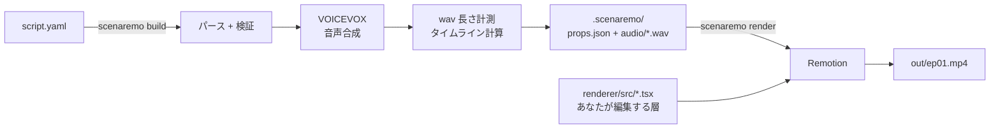

# scenaremo

**台本(YAML)を1つ書くだけで、キャラが喋る解説動画ができる。**

`scenaremo` は、YAML の台本から [VOICEVOX](https://voicevox.hiroshiba.jp/) で音声を合成し、
[Remotion](https://www.remotion.dev/) でスライドショー形式の解説動画をレンダリングする Go 製 CLI です。

動画投稿の民主化を目指しています。台本を書ける人なら誰でも、動画編集ソフトを触らずに解説動画を量産できる状態がゴールです。

> **Status: 設計フェーズ。** このドキュメントは実装のゴールを示す設計図です。
> 現在の進捗は [Issues](https://github.com/takiren/scenaremo/issues) を参照してください。

---

## 何を作るのか

- **スライドショー形式の解説動画**。画像が切り替わり、キャラクターが喋り、フェードで繋がる
- 音声合成は VOICEVOX（起動済みであることが前提）
- 台本は YAML（JSON も可）。人間が読み書きする唯一の入力
- 気に入らないところは **React コンポーネントを直接書き換えて調整できる**

### やらないこと

- 動画編集ソフトの代替にはしない。タイムラインを GUI で編集する機能は持たない
- 凝ったアニメーションを YAML で表現しようとはしない。それは React 側で書く領分
- **YAML でコンポーネントツリーは書けるようにしない。** ネスト可能な `component` 配列は
  実装こそ容易ですが、それは JSX を YAML で書き直すことに等しく、型検査も補完も失われます。
  小さい部品を組み合わせたい場合は、**合成済みのコンポーネントを1つ書いて registry に登録**してください
  （→ [設計方針 6](#6-台本からコードは生成しない表現力の限界には-react-で答える)）。
  合成は React 側で行い、台本は「誰が何を喋るか」の宣言に留めます

---

## 全体像



1. **CLI が台本をパース**し、JSON Schema で検証する
2. **VOICEVOX の `/audio_query` → `/synthesis`** を叩いて wav を生成する（内容ハッシュでキャッシュ）
3. **wav の実測長からタイムラインを計算**する。動画の尺は音声で決まる
4. **`props.json` を出力**する。これが CLI と Remotion の間の唯一のインターフェース
5. **共有の Remotion プロジェクトが props.json を読んで描画**し、mp4 を出力する

CLI は「音を作ってタイムラインを組む」ところまで。**見た目の責務は一切持たず、すべて React 側にあります。**

---

## ディレクトリ構成

動画ごとに Remotion プロジェクトを作るのではなく、**共有レンダラ 1 つ × 動画ごとの props** という構成にします。
`node_modules` がリポジトリに 1 つで済み、動画を増やすコストがほぼゼロになります。

```
scenaremo/
├── cmd/scenaremo/          # CLI エントリポイント
├── internal/
│   ├── script/             # YAML/JSON パース + 検証
│   ├── tts/                # 音声合成エンジン (VOICEVOX クライアント)
│   ├── cache/              # 音声キャッシュ
│   ├── audio/              # WAV 長さ計測
│   ├── timeline/           # 秒 → フレーム変換、シーン配置
│   ├── props/              # props.json の型・生成・書き出し（クレジット集計を含む）
│   ├── project/            # init / eject
│   └── doctor/             # 前提条件チェック
├── renderer/               # ★ 共有 Remotion プロジェクト (pnpm)
│   └── src/
│       ├── index.ts        # registerRoot
│       ├── Root.tsx        # Composition 定義。props.json から尺と解像度を決める
│       ├── Slideshow.tsx   # メインコンポジション
│       ├── Scene.tsx       # 画像 + トランジション
│       ├── Subtitle.tsx    # 字幕
│       └── schema.ts       # zod スキーマ (docs/props.schema.json に追従)
├── videos/                 # ★ あなたの動画たち
│   └── ep01/
│       ├── script.yaml     # 人間が書く
│       ├── assets/         # 画像・BGM
│       └── .scenaremo/     # 生成物 (gitignore)
├── templates/              # go:embed される雛形 (init / eject 用)
├── docs/
│   ├── schema.json         # 台本スキーマの唯一の正
│   └── props.schema.json   # props.json スキーマの唯一の正
└── examples/
```

---

## 台本の書き方

`scenes`（画像1枚）の下に `lines`（セリフ）がぶら下がる 2 階層構造です。
1 枚の画像に複数のセリフを喋らせられるので、解説動画の構造とそのまま一致します。

```yaml
# yaml-language-server: $schema=../../docs/schema.json

meta:
  title: "Remotionで解説動画を作る"
  aspect: "16:9"        # 16:9 | 9:16
  fps: 30

# 話者のエイリアス定義。声を差し替えたくなったらここだけ直す
speakers:
  zundamon:
    engine: voicevox
    styleId: 3
  metan:
    engine: voicevox
    styleId: 2
    speedScale: 1.05

defaults:
  speaker: zundamon
  transition: fade
  gapMs: 300            # 同じシーン内のセリフ間の余白
  sceneGapMs: 100       # シーンの末尾（＝シーン間と動画末尾）の余白

scenes:
  - image: assets/01-title.png
    transition: fade
    lines:
      - text: 今日はRemotionの話をするのだ
      - speaker: metan
        text: |
          スライドショー形式の
          解説動画を作りますね

  - image: assets/02-overview.png
    lines:
      - text: まず台本を書くのだ
      - text: あとはCLIが音声を作ってくれるのだ
```

先頭の `$schema` コメントによって、VS Code で **補完とリアルタイム検証が効きます**。
将来的に開発者以外へ配ることを考えると、ここは重要な入り口です。

---

## コマンド

| コマンド | 役割 |
|---|---|
| `scenaremo init <dir>` | 台本の雛形と `assets/` を作る |
| `scenaremo build <dir>` | 音声を合成し、`.scenaremo/props.json` を出力する |
| `scenaremo preview <dir>` | Remotion Studio を起動してブラウザで確認する |
| `scenaremo render <dir>` | build してから mp4 まで書き出す |
| `scenaremo speakers` | VOICEVOX の話者・スタイル一覧を表示する |
| `scenaremo credits <dir>` | 使用話者のクレジット表記を出力する |
| `scenaremo doctor` | Node / VOICEVOX / 依存関係を診断する |
| `scenaremo eject <dir>` | 独立した Remotion プロジェクトとして切り出す |

---

## 設計方針

### 1. 生成物の境界を契約として固定する

「量産したい」と「気に入らないところを手で直したい」は、放っておくと正面衝突します
（再生成のたびに手修正が消える）。そこで **3 つの層に分け、誰が所有するかを固定します**。

| 層 | 所有者 | 再生成時の扱い |
|---|---|---|
| `videos/ep01/script.yaml` | **あなた**（唯一の入力） | CLI は書き換えない |
| `videos/ep01/.scenaremo/` | **CLI**（wav / props.json / キャッシュ） | 毎回作り直す。**手で編集しない** |
| `renderer/src/*.tsx` | **あなた**（見た目のすべて） | 初回生成のみ。以後 CLI は触らない |

**手修正は YAML か React のどちらかで行う。中間生成物は編集対象ではない。**
このルールさえ守れば、いつ再生成しても壊れません。

### 2. 動画の尺は音声が決める

台本にフレーム数や秒数は書きません。合成した wav の実測長からタイムラインを組み立てます。
総フレーム数は CLI が確定させ、Remotion の `calculateMetadata` はその値をそのまま採用します。

**秒 → フレームの変換は、音声も余白も一律で切り上げます。**

- 切り上げるのは音の欠けを防ぐため。Remotion の `Sequence` は `durationInFrames` で音を打ち切るので、
  切り捨てると 1 フレームに満たない末尾が毎回削られる
- 余白は切っても音が欠けないので四捨五入でも構わないが、**規則が 1 つで説明できるほうが契約として強い**。
  差は 1 フレーム分の無音（30fps で 33ms）にしかならない
- 丸めた値は整数のまま積み上げ、途中で秒に戻さない。ここで生まれる誤差は「ズレ」ではなく
  **「無音がわずかに伸びる」形でしか出ない**。各音声は自分の `Sequence` の先頭で鳴るため、
  音と音の同期は構成上ずれようがなく、伸びるのは間だけ
- **props.json のフレーム数は、受け取る側で計算し直さないこと。**
  秒に戻して掛け直すと丸めが再現できず、かえって音がずれる

**余白は 2 種類あります。**

| 設定 | どこに入るか | 既定 |
|---|---|---|
| `defaults.gapMs` | 同じシーンの中のセリフとセリフの間 | 300ms |
| `defaults.sceneGapMs` | シーンの末尾。シーン間の間（ま）と動画末尾の余韻の両方 | 100ms |

`sceneGapMs` は**次のシーンの頭ではなく前のシーンの尻に付きます**。繋ぎは次のシーンの先頭で行われ、
そのぶん前のシーンの末尾に重なるので、余白を尻に置いておくと**繋ぎがその無音の中に収まります**。
頭に置くと繋ぎは結局前のシーンの語尾に被り、一番きれいな形（無音の間に絵が切り替わる）になりません。

末尾の余白は最後のシーンにも同じように付きます。「シーンとシーンの間」と「動画の末尾」は
どちらも*喋り終わってからシーンが終わるまで*であって、別の値にする理由が無いためです。
おかげで最後のセリフの終了と同時に動画が切れることもありません。

既定の 100ms は、間延びさせない最小限の値です。実効では約 300ms（後述の 200ms が乗る）になります。

これは既定のトランジション 400ms より短いので、**既定のままではフェードの一部が前のシーンの語尾に重なります**。
絵の切り替わりを完全に無音の中で終わらせたい場合や、話題の切れ目でもっと深い間を取りたい場合は、
`sceneGapMs` に繋ぎより長い値（例えば `500`）を指定してください。

なお「余白ゼロ」は無音ゼロではありません。VOICEVOX は既定で各 wav の前後に 0.1 秒ずつ無音を入れるため、
実効の余白は `gapMs + 200ms` / `sceneGapMs + 200ms` になります。**0 にしても間は消えません**（→ issue #44）。

**長さの計測に ffmpeg / ffprobe は使いません。** 測る対象は VOICEVOX が返す WAV だけで、
[`go-audio/wav`](https://github.com/go-audio/wav) を使えば 20 行程度で済むためです。
外部バイナリのインストールを利用者に要求することは、Phase 3（開発者以外が使う）において
最大の脱落ポイントになります。Remotion 自身が ffmpeg を内蔵していることもあり、CLI 側でもう1つ増やす理由がありません。

> **実装上の注意:** `wav.Decoder.Duration()` は使わないこと。
> 内部で data チャンクではなく **RIFF チャンクのサイズ**を用いているため、
> 常に 36 バイト分（24kHz/16bit mono で約 0.75ms）過大な値を返します。
> `FwdToPCM()` を呼んだうえで `PCMLen() / (SampleRate × NumChans × BitDepth/8)` から求めてください。
> `FwdToPCM()` を呼ばないと `PCMLen()` は 0 を返します。

将来 BGM に mp3 等を許す場合は、ffprobe を **任意依存**（あれば使い、無ければ WAV のみ対応）として扱い、
`doctor` で案内します。必須依存には格上げしません。

### 3. 音声はキャッシュする

キャッシュキーは `hash(engine, styleId, text, speedScale, ...)` です。
台本を 1 行直しただけで全セリフを再合成していては、量産は回りません。

### 4. 音声合成エンジンは差し替え可能にする

VOICEVOX / AivisSpeech / COEIROINK は **API がほぼ同一**なので、
`engine` と `baseUrl` を切り替えるだけで実質対応できます。
将来のクラウド TTS のために interface だけ切っておき、それ以上の抽象化はしません。

### 5. スキーマの正は 1 箇所に置く

Go の struct と Remotion 側の zod で同じ形を 2 回書くことになるため、**JSON Schema を唯一の正**とし、
両者がそこに従います。乖離は CI で検出します。

| スキーマ | 対象 | 誰が読むか |
|---|---|---|
| `docs/schema.json` | 台本 | エディタ (yaml-language-server) と CLI |
| `docs/props.schema.json` | props.json | CLI と renderer 側の zod |

props.json は人間が書かないのでエディタ補完のためではありませんが、**これが CLI と Remotion の契約書そのもの**です。
契約が実際にどういう JSON になるのかは [`examples/minimal/props.json`](examples/minimal/props.json) に現物を置いてあります。

### 6. 台本からコードは生成しない。表現力の限界には React で答える

台本から TSX を生成する方式は採りません。scenaremo は「台本を直して build」を何十回も繰り返すため、
**再生成のたびに手修正が消える**うえ、動画ごとに分裂した生成コードには共通の改善が伝播しないためです。

代わりに **props.json というデータを Remotion に渡します**。

```bash
remotion render renderer/src/index.ts Slideshow out/ep01.mp4 \
  --props=videos/ep01/.scenaremo/props.json
```

尺は受け側の `calculateMetadata` が props.json から読み取ります。台本にフレーム数を書かせない仕掛けの核です。

この核を守るため、**props.json は動画先頭からの絶対位置を持ちません。**
シーンは「尺」を、セリフは「シーンの先頭からの相対位置」を持ちます。

renderer は `@remotion/transitions` の `TransitionSeries` でシーンを並べます。
TransitionSeries は子シーケンスを繋ぎのぶん重ねて前へ詰めるので、絶対位置を渡しても意味を成しません。
**絶対位置と混ぜると props.json の数字が「実際に何フレーム目か」と食い違い**、
字幕も口パクも音声も、各自が引き算をやり直さないと位置を知れなくなります。
相対に振り切れば、どの値もそれが置かれる `Sequence` の中でそのまま使えます。

繋ぎはシーンの先頭で行われ、**ちょうど終わったところで最初のセリフが鳴り始めます**。
次の声が鳴り始めた時点で新しい画像が出揃っている状態を作るためで、
逆にすると新しい声が喋っている間まだ前の画像が透けていて、同期ずれとして見えます。

そのぶん各シーンは繋ぎの分だけ尺を長く申告します。重なって消えるので、総尺は変わりません。

```
総フレーム数 = Σ シーンの尺 − Σ 繋ぎの尺 = Σ (喋りの尺 + シーン末尾の余白)
```

繋ぎの長さは props.json がフレーム数で持ちます。renderer は
`linearTiming({durationInFrames})` のように**その値をそのまま使う timing** を選んでください。
`springTiming` のように設定から尺が決まるものを使うと、CLI の申告と食い違って音がずれます。

データ駆動の弱点は「この場面だけズームしたい」がスキーマの表現力に縛られることですが、
ここで**スキーマを拡張し続けると YAML が第二のプログラミング言語になって破綻します**。
そこで逃げ道を React 側に開けます。

```yaml
scenes:
  - image: assets/03.png
    component: zoom       # renderer/src/scenes/Zoom.tsx を使う
    props:
      focus: [0.3, 0.6]
```

段階的に逃げられます。

1. **YAML で足りる** → そのまま書く
2. **演出を足したい** → コンポーネントを1つ書いて `component:` で指名する。**全動画で再利用できる資産になる**
3. **動画まるごと作り込みたい** → `eject` して独立プロジェクトにする

コード生成を使うのは 3 の `eject` だけです。**一度きりで、以後 CLI が関与しない場面でこそコード生成は正しく働きます。**

### 7. アセットはビデオディレクトリを public に差し替えて解決する

Remotion の `staticFile()` は public ディレクトリを参照しますが、画像も音声も `videos/<id>/` の下にあり、
共有レンダラの `renderer/public/` にはありません。共有レンダラ構成における最大の技術リスクはここでした。

**`--public-dir` にビデオディレクトリ自体を渡す**ことで解決します。

```bash
remotion render renderer/src/index.ts Slideshow out/ep01.mp4 \
  --public-dir=/path/to/videos/ep01 \
  --props=/path/to/videos/ep01/.scenaremo/props.json
```

props.json のパスがビデオディレクトリからの相対（`assets/01-title.png`、`.scenaremo/audio/*.wav`）なのは、
そのまま `staticFile()` に渡せる形にしておくためです。**この解決方式が props.json のパス表現を決めています。**

Remotion 4.0.508 で実機確認した挙動:

- `--public-dir` は**レンダラのプロジェクト外**を指せる。解決は **cwd 基準**で、絶対パスも使える
- `.scenaremo/` のような**ドット始まりのディレクトリも配信される**（音声はここに置かれる）
- `--public-dir` を変えて連続でレンダリングしても、**バンドルのキャッシュは正しく差し替わる**。
  ep01 の直後に ep02 を出しても前の動画のアセットが混ざることはない
- `remotion studio --public-dir` も同じく効く（`scenaremo preview` はこれを使う）
- 日本語や空白を含むファイル名も通る（`staticFile()` がセグメントごとに URL エンコードする）
- アセットが見つからないとき remotion は **exit code 1** で終わる。CLI はこれで失敗を検出できる

採らなかった案:

| 案 | 実測した結果 |
|---|---|
| `renderer/public/<id>/` へコピー | 動きはする。ただし props.json のパスに `<id>/` 接頭辞が必要になり、「ビデオディレクトリからの相対」という契約が崩れる。動画の本数だけアセットが二重に置かれる |
| props.json に絶対パスを埋めて `` へ直接渡す | **動かない。** 素の絶対パスは dev サーバの origin 相対と解釈されて 404 になり、`file://` は Chrome が `Not allowed to load local resource` で拒否する。`staticFile()` 自身も絶対パスを TypeError で弾く |

実装上の注意:

- `staticFile()` が返す URL には `/static-<hash>` の接頭辞が付く。**URL をハードコードしない**
- `staticFile()` は `./` や `..` で始まるパスを TypeError で弾く。props.json のパスに `./` を付けない

---

## セットアップ

### 前提条件

- **Go 1.24+**（CLI をソースからビルドする場合のみ）
- **Node.js 20 以上** と **pnpm**（Remotion のレンダリングに必要）
- **VOICEVOX ENGINE が起動していること**（既定 `http://127.0.0.1:50021`）

**ffmpeg / ffprobe のインストールは不要です。**（→ [設計方針 2](#2-動画の尺は音声が決める)）

VOICEVOX は当面「すでに起動している」前提です。
CLI がバックグラウンドで自動起動するかどうかは、Phase 2 で検討します。

```bash
# 依存の導入（Remotion は renderer/ にある。動画を何本作ってもここ 1 つで済む）
pnpm install --dir renderer

# 前提条件の診断
scenaremo doctor

# 動画を1本作る
scenaremo init videos/ep01
$EDITOR videos/ep01/script.yaml
scenaremo preview videos/ep01     # ブラウザで確認しながら調整
scenaremo render videos/ep01      # → out/ep01.mp4
```

---

## ロードマップ

| Phase | 内容 |
|---|---|
| **Phase 1（現在）** | VOICEVOX 起動済み・Node 導入済みを前提とした CLI。開発者が対象 |
| **Phase 2** | VOICEVOX の自動起動 / Docker 対応、縦型(9:16)出力、BGM・効果音、字幕、口パク |
| **Phase 3** | 開発者以外が使えるようにする。GUI もしくは Web UI、クラウドレンダリング |

Phase 3 を見据えて、**エラーメッセージの質と `doctor` の診断精度**は早い段階から重視します。
開発者以外にとっては、そこが唯一の道しるべになるためです。

---

## ライセンスと利用上の注意

このリポジトリのコードは **MIT ライセンス**です。ただし、**動画を作るあなたには別途 2 つの注意点があります。**

### Remotion のライセンス

Remotion は MIT ではなく独自ライセンスです。個人利用や小規模な組織は無料ですが、
**一定規模以上の企業が利用する場合は有償の Company License が必要**です。
条件は必ず [Remotion の公式ライセンス](https://www.remotion.dev/license) で確認してください。

### VOICEVOX の利用規約

VOICEVOX で合成した音声を公開する場合、**音声ライブラリごとにクレジット表記が必要**です（例: `VOICEVOX:ずんだもん`）。
規約はキャラクターごとに異なるため、利用前に各音声ライブラリの規約を確認してください。

`scenaremo credits` が台本から使用話者を集計してクレジット表記を出力し、
動画末尾へ自動挿入することもできます。**表記漏れによる事故を防ぐことは、この CLI の重要な役割**と位置づけています。

### 素材

`assets/` に置く画像・BGM のライセンスはあなたの責任で確認してください。

---

## 貢献

設計フェーズのため、まずは [Issues](https://github.com/takiren/scenaremo/issues) での議論を歓迎します。
