# scenaremo スキーマ仕様 & タイムライン設計書

このドキュメントでは、`scenaremo` が扱う 2 つのスキーマ（台本 `script.yaml` と 中間表現 `props.json`）の全フィールド仕様、および音声を軸としたタイムライン計算・余白メカニズムの技術的詳細を解説します。

---

## 1. 概要と二大スキーマ

`scenaremo` には役割の異なる 2 つのスキーマが存在します。どちらも `docs/` に配置された JSON Schema が唯一の正 (Single Source of Truth) です。

```mermaid
flowchart LR
    subgraph 人間の入力
        A["script.yaml<br/>(docs/schema.json)"]
    end
    subgraph Go CLI
        B["internal/script"] --> C["internal/timeline"]
        C --> D["internal/props"]
    end
    subgraph 契約・中間出力
        E[".scenaremo/props.json<br/>(docs/props.schema.json)"]
    end
    subgraph Remotion (React)
        F["renderer/src/schema.ts<br/>(zod 検証)"]
    end

    A --> B
    D --> E
    E --> F
```

| スキーマファイル | 対象 | 主な読み手 | 役割 |
|---|---|---|---|
| [`docs/schema.json`](file:///Users/taki/source/scenaremo-docs/docs/schema.json) | 台本 (`script.yaml`) | 人間, エディタ (`yaml-language-server`), CLI (`internal/script`) | 人間が読み書きする入力。セリフやシーン順、話者設定を宣言 |
| [`docs/props.schema.json`](file:///Users/taki/source/scenaremo-docs/docs/props.schema.json) | 中間表現 (`props.json`) | CLI (`internal/props`), Remotion (`renderer/src/schema.ts`) | **CLI と Remotion の契約書**。確定したフレーム数・相対位置・音声パスを保持 |

---

## 2. タイムライン計算 & 余白メカニズム

### 2.1 「動画の尺は音声が決める」原則

`scenaremo` の台本にはタイムライン（秒数やフレーム数）を記述しません。
1. VOICEVOX で生成した WAV ファイルの実際の長さ（ミリ秒）を計測
2. フレームレート (fps) に合わせて **一律切り上げ** でフレーム数 (`durationInFrames`) に変換
3. 余白 (`gapMs`, `sceneGapMs`) や繋ぎ (`transition`) を加算して最終タイムラインを組み立て

> [!IMPORTANT]
> **なぜ一律切り上げなのか？**  
> Remotion の `Sequence` は `durationInFrames` に達した瞬間に再生を打ち切ります。もし秒→フレーム変換で四捨五入や切り捨てを行うと、1フレーム未満の音声末尾が毎回カットされ、語尾が切れ落ちてしまいます。

### 2.2 2 種類の余白と VOICEVOX 既定無音 (+200ms)

台本で調整できる余白は `defaults.gapMs` と `defaults.sceneGapMs` の 2 つです。

```
【1つのシーン内の構造】

┌──────────────────────── Scene ────────────────────────┐
│                                                        │
│  Line 1 (WAV)   gapMs    Line 2 (WAV)    sceneGapMs    │
│ [━━━━ Speech ━━━━]│   │ │[━━━━ Speech ━━━━]│         │   │
│                 └───┘                 └─────────┘   │
└────────────────────────────────────────────────────────┘
```

| 設定項目 | 適用される位置 | 規定値 (既定) |
|---|---|---|
| `defaults.gapMs` | 同一シーン内のセリフ間 | `300` (ms) |
| `defaults.sceneGapMs` | シーンの末尾（次シーンとの間 ＆ 動画末尾） | `100` (ms) |

#### VOICEVOX 既定無音 (+200ms) の注意点
VOICEVOX ENGINE は生成する WAV ファイルの前後に **約 0.1秒 (100ms) ずつ、計 200ms の無音** を自動で焼き込みます。
そのため、実効的な無音時間は以下のようになります：

$$\text{実効セリフ間余白} = \text{gapMs} + 200\,\text{ms}$$
$$\text{実効シーン末尾余白} = \text{sceneGapMs} + 200\,\text{ms}$$

したがって、`gapMs: 0` や `sceneGapMs: 0` と指定しても無音がゼロになるわけではありません。

### 2.3 トランジションと余白の重なり

シーン切り替え時のトランジション（例: `fade`）は、**次のシーンの頭で行われます**。

```mermaid
gantt
    title トランジションとシーン尺の重なり構造
    dateFormat X
    axisFormat %s

    section シーン 1
    喋り + gapMs       :active, s1a, 0, 100
    sceneGapMs (末尾余白) :s1b, 100, 110
    トランジション重なり分  :crit, s1c, 110, 120

    section シーン 2 (fade 400ms)
    トランジション(繋ぎ)    :active, s2a, 110, 120
    喋り開始 (Line 1)     :s2b, 120, 190
```



- トランジションの実行中、前のシーンの末尾と次のシーンの先頭が重なります。
- 前のシーンの `durationInFrames` には、**[喋り] + [sceneGapMs] + [transition.durationInFrames]** が含まれます。
- `sceneGapMs` をトランジション時間より長く（例: `sceneGapMs: 500`, フェード `400ms`）設定すると、**完全な無音・静止画の中で画面がフェード**し、美しいシーン転換が得られます。

---

## 3. props.json の座標系 (相対フレーム構造)

`props.json` では、動画先頭からの**絶対フレーム座標を一切持ちません**。

### なぜ相対座標なのか？
Remotion の `@remotion/transitions` 内の `TransitionSeries` は、トランジションの長さ分だけ後続のシーンを自動的に手前（過去）に重ねて配置します。
もし `props.json` に絶対フレーム位置（例: 「シーン2は300フレーム目から開始」）を記録すると、`TransitionSeries` の繰り上げ配置によって実再生位置とずれが生じ、字幕や音声のタイミング計算が崩壊します。

| 要素 | 位置の指定方法 | 説明 |
|---|---|---|
| `scenes[].durationInFrames` | 相対尺 | そのシーン単体が要求する占有フレーム数（繋ぎ重なり分を含む） |
| `scenes[].lines[].startFrame` | **シーン先頭からの相対フレーム** | シーン内での音声再生開始位置。最初のセリフの `startFrame` は `transition.durationInFrames` と一致する |
| `scenes[].lines[].durationInFrames` | 相対尺 | 当該セリフ WAV の切り上げ実測フレーム数 |

---

## 4. スキーマ フィールド詳細

### 4.1 台本スキーマ (`script.yaml` / `docs/schema.json`)

#### ルート要素
- `meta` (必須): 動画のタイトルやアスペクト比
- `speakers` (必須): 話者エイリアスと VOICEVOX スタイル ID のマッピング
- `defaults` (任意): セリフ・シーンで省略された場合のデフォルト値
- `scenes` (必須): シーンの配列（最低 1 つ以上）

#### `speakers` のパラメータ
```yaml
speakers:
  zundamon:
    engine: voicevox     # 音声合成エンジン (現在 voicevox のみ)
    styleId: 3           # VOICEVOX スタイル ID (scenaremo speakers で確認)
    speedScale: 1.0      # 話速 (0.5 〜 2.0)
    pitchScale: 0.0      # 音高 (-0.15 〜 0.15)
    intonationScale: 1.0 # 抑揚 (0.0 〜 2.0)
    volumeScale: 1.0     # 音量 (0.0 〜 2.0)
    color: "#69C6A0"     # 字幕の色 (#RGB または #RRGGBB / 省略時は renderer の既定色)
```

> [!NOTE]
> `color` だけが見た目の設定で、他は合成のパラメータです。字幕の色を変えても音声のキャッシュは無効になりません（キャッシュキーは合成パラメータから作られるため）。

#### `scenes` のパラメータ
```yaml
scenes:
  - image: assets/01.png   # [必須] 画像相対パス
    transition: fade       # fade | none (省略時は defaults.transition)
    component: default     # renderer 側の React コンポーネント名
    props:                 # component に引き渡す任意プロパティ (JSON/YAML オブジェクト)
      zoom: 1.2
    lines:                 # [必須] セリフのリスト
      - speaker: zundamon
        text: こんにちはのだ
      - text: クーベルネティスの話をするのだ      # [必須] 読み上げる文字列
        caption: Kubernetes の話をするのだ       # 字幕に出す文字列 (省略時は text)
```

#### 読み上げる文字列 (`text`) と、字幕に出す文字列 (`caption`)

聞いたことのない言葉ほど VOICEVOX は正しく読まないため、`text` には読み仮名を書くことになります。
ところがその文字列をそのまま字幕に出すと、視聴者は綴りを受け取れず、**その言葉を検索できません**。
`caption` はこの 2 つを分けるための項目で、省略時は `text` がそのまま字幕になります（フォールバックは CLI が解決し、`props.json` には常に埋まった値が載ります）。

`caption` は合成には一切影響しません。エンジンへ渡るのも音声キャッシュのキーになるのも `text` だけなので、字幕の言い回しだけを直しても音声は作り直されません。

---

### 4.2 中間表現スキーマ (`props.json` / `docs/props.schema.json`)

#### ルート要素
```json
{
  "version": 1,
  "$generatedBy": "scenaremo v0.1.0",
  "$note": "手で編集しないでください。scenaremo build により上書きされます。",
  "meta": {
    "title": "動画タイトル",
    "aspect": "16:9",
    "width": 1920,
    "height": 1080,
    "fps": 30,
    "durationInFrames": 450
  },
  "speakers": {
    "zundamon": {"color": "#69C6A0"}
  },
  "scenes": [...],
  "credits": {
    "durationInFrames": 90,
    "entries": [...]
  }
}
```

- `speakers`: 話者エイリアスから、**描画に要る属性**への対応表。台本に定義されたすべての話者が入ります。合成のパラメータ（`styleId` など）は載りません。音はもう作り終わっており、renderer から使い道が無いためです。

#### `lines` 要素（確定済みデータ）
```json
{
  "speaker": "zundamon",
  "text": "クーベルネティスの話をするのだ",
  "caption": "Kubernetes の話をするのだ",
  "audio": ".scenaremo/audio/a1b2c3d4.wav",
  "startFrame": 12,
  "durationInFrames": 75
}
```
- `audio`: CLI が生成・キャッシュした WAV ファイルへの相対パス (`videos/<id>/` 基準)。
- `startFrame`: トランジション（繋ぎ）が明けた直後のフレームインデックス。
- `caption`: 字幕に出す文字列。台本が省略していれば `text` と同じ値が入ります（フォールバックは CLI が解決済み）。

> [!NOTE]
> `caption` と `speakers` は、この項目より前に生成された `props.json` には存在しないため `required` に入っていません（項目を足すだけの後方互換な変更なので `version` は上げていません）。renderer 側は `caption` が無ければ `text` へ、`speakers` から引けなければ既定の見た目へ倒します。

---

## 5. スキーマの更新手順と CI 検証

1. **`docs/schema.json` または `docs/props.schema.json` を変更**する。
2. Go 側の構造体（`internal/script`, `internal/props`）を追従修正する。
3. Remotion 側の zod スキーマ（[`renderer/src/schema.ts`](file:///Users/taki/source/scenaremo-docs/renderer/src/schema.ts)）を追従修正する。
4. `go test ./...` および `pnpm --dir renderer test` を実行して契約整合性を検証する。
