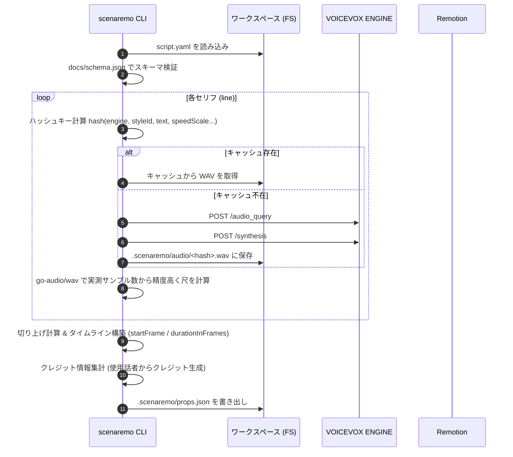

# scenaremo アーキテクチャ & パイプライン仕様書

このドキュメントでは、`scenaremo` の全体アーキテクチャ、Go CLI 内部のモジュール構造、処理パイプライン、およびアセット解決メカニズムについて解説します。

---

## 1. 全体アーキテクチャ

`scenaremo` は「共有の Remotion レンダラ」と「動画ごとの設定・台本」を分離した構造を採用しています。

```mermaid
flowchart TB
    subgraph ユーザー所有
        YAML["videos/ep01/script.yaml"]
        Assets["videos/ep01/assets/*"]
        ReactComp["renderer/src/*.tsx"]
    end

    subgraph Go CLI (scenaremo)
        CMD["cmd/scenaremo"]
        Script["internal/script (パース・JSON Schema検証)"]
        TTS["internal/tts (VOICEVOX HTTP API)"]
        Cache["internal/cache (音声ハッシュキャッシュ)"]
        Audio["internal/audio (go-audio/wav 長さ計測)"]
        Timeline["internal/timeline (切り上げ丸め・相対位置確定)"]
        PropsGen["internal/props (props.json 生成・書き出し)"]
    end

    subgraph 外部プロセス
        VV["VOICEVOX ENGINE (http://127.0.0.1:50021)"]
        Remotion["Remotion CLI / Studio (Node.js / pnpm)"]
    end

    subgraph CLI生成物 (gitignore)
        Props["videos/ep01/.scenaremo/props.json"]
        WAVs["videos/ep01/.scenaremo/audio/*.wav"]
    end

    YAML --> CMD --> Script
    Script --> TTS
    TTS <--> VV
    TTS --> Cache
    Cache --> WAVs
    WAVs --> Audio
    Audio --> Timeline
    Timeline --> PropsGen
    PropsGen --> Props

    Props & Assets & WAVs -->|--public-dir / --props| Remotion
    ReactComp --> Remotion
    Remotion --> MP4["out/ep01.mp4"]
```

---

## 2. 3 つの所有権の層 (Ownership Boundary)

再生成（`scenaremo build`）を何十回繰り返しても修正が消えないようにするため、ファイルを 3 つの層に分け、所有者を明確に固定しています。

| 層 | 対象パス | 所有者 | 再生成 (`build`) 時の扱い |
|---|---|---|---|
| **入力層** | `videos/<id>/script.yaml`<br/>`videos/<id>/assets/*` | **ユーザー** | CLI は**一切編集・上書きしない** |
| **中間生成物層** | `videos/<id>/.scenaremo/*`<br/>(`props.json`, `audio/*.wav`) | **CLI** | CLI が管理。手編集禁止（毎回全上書き） |
| **レンダラ層** | `renderer/src/*.tsx` | **ユーザー** | 初回生成後は CLI は触らない。見た目の変更はここで行う |

---

## 3. CLI 内部パッケージ構成

```
cmd/scenaremo/            # CLI エントリポイント (cobra 命令定義)
internal/
├── script/               # 台本 (YAML/JSON) のパースと docs/schema.json による検証
├── tts/                  # VOICEVOX ENGINE API クライアント (/audio_query, /synthesis)
├── cache/                # 合成パラメータのハッシュによる WAV ファイルキャッシュ
├── audio/                # WAV ファイルのサンプル数・サンプリングレートから正確な実測長を計算
├── timeline/             # 実測長から切り上げフレーム数・余白・繋ぎ・相対 startFrame を確定
├── props/                # props.json のデータ構造、クレジッ集計、JSON 出力
├── project/              # scenaremo init / eject のテンプレート展開処理
└── doctor/               # Node, pnpm, VOICEVOX ENGINE 等のシステム環境診断
```

---

## 4. 処理パイプライン (`scenaremo build`)

`scenaremo build <dir>` が実行された際の詳細なステップです。



---

## 5. `--public-dir` によるアセット解決メカニズム

共有レンダラ構成（`renderer/` が 1 つで動画ディレクトリが分離している構成）において、画像や音声アセットを動的に読み込ませる解決策です。

### 課題
Remotion の `staticFile()` は既定で `renderer/public/` のみを参照しますが、アセット実体は `videos/<id>/assets/` および `videos/<id>/.scenaremo/audio/` に散在しています。

### 解決策
Remotion 実行時に `--public-dir` に動画ディレクトリ自体を指定します。

```bash
remotion render renderer/src/index.ts Slideshow out/ep01.mp4 \
  --public-dir=/path/to/videos/ep01 \
  --props=/path/to/videos/ep01/.scenaremo/props.json
```

- `props.json` 内のすべてのファイルパス（`image`, `audio`）は動画ディレクトリからの相対パス（例: `assets/01.png`, `.scenaremo/audio/a1b2.wav`）として記録されます。
- Remotion の `staticFile("assets/01.png")` がそのまま動作します。
- `.scenaremo` のようなドットで始まる隠しディレクトリ配下のファイルも正しく配信・参照できます。
