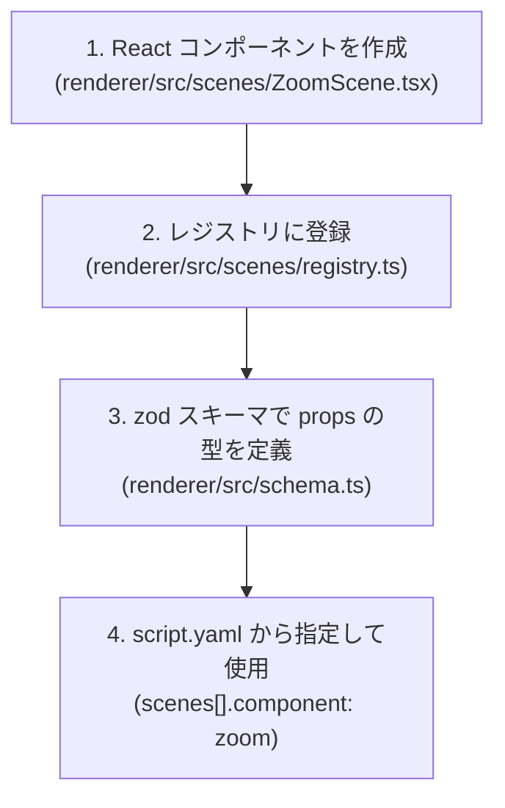

# カスタム React コンポーネント開発ガイド

`scenaremo` では、YAML スキーマを複雑化させることなく高度な映像演出を実現するために、**「表現力の限界には React で答える」** という設計方針を採っています。

このガイドでは、`renderer/src/` 内に新しいシーンコンポーネントを作成し、コンポーネントレジストリに登録して `script.yaml` から呼び出すまでの全手順を説明します。

---

## 1. 全体フロー



---

## 2. ステップ・バイ・ステップガイド

### ステップ 1: 新しいシーンコンポーネントを作成する

`renderer/src/scenes/` ディレクトリにコンポーネントを作成します。  
シーンコンポーネントは、`props.json` から渡される `SceneProps`（画像パス、セリフ一覧、任意カスタム `props` など）を受け取ります。

```tsx
// renderer/src/scenes/ZoomScene.tsx
import React from 'react';
import { Img, interpolate, staticFile, useCurrentFrame } from 'remotion';
import { SceneProps } from '../schema';

export interface ZoomSceneCustomProps {
  scale?: number;
  durationInFrames?: number;
}

export const ZoomScene: React.FC<SceneProps> = ({ scene }) => {
  const frame = useCurrentFrame();
  const customProps = (scene.props as ZoomSceneCustomProps) ?? {};
  const maxScale = customProps.scale ?? 1.2;

  // フレーム経過に応じてじわっとズームインする演出
  const scale = interpolate(
    frame,
    [0, scene.durationInFrames],
    [1.0, maxScale],
    { extrapolateRight: 'clamp' }
  );

  return (
    <div style={{ position: 'relative', width: '100%', height: '100%', overflow: 'hidden' }}>
      
    </div>
  );
};
```

---

### ステップ 2: レジストリにコンポーネントを登録する

`renderer/src/scenes/registry.ts` にコンポーネントをマッピングします。

```typescript
// renderer/src/scenes/registry.ts
import React from 'react';
import { SceneProps } from '../schema';
import { DefaultScene } from './DefaultScene';
import { ZoomScene } from './ZoomScene';

export const sceneRegistry: Record<string, React.FC<SceneProps>> = {
  default: DefaultScene,
  zoom: ZoomScene, // script.yaml で component: zoom として指名できるようになる
};
```

---

### ステップ 3: 台本 (`script.yaml`) から呼び出す

台本の `component` フィールドにレジストリキーを指定し、必要に応じて `props` にカスタムプロパティを記述します。

```yaml
# script.yaml
scenes:
  - image: assets/01-title.png
    transition: fade
    lines:
      - text: タイトル画面なのだ

  # カスタムコンポーネント zoom を使用
  - image: assets/02-highlight.png
    component: zoom
    props:
      scale: 1.35
    lines:
      - text: ここが重要なポイントなのだ！
```

---

## 3. ベストプラクティス

### 1. 音声と字幕は共通レイヤーに任せる
シーンコンポーネントの責務は **背景や図解・画像のアニメーション表現** です。音声再生 (`<Audio>`) や字幕描画 (`Subtitle.tsx`) は共通の [`Slideshow.tsx`](file:///Users/taki/source/scenaremo-docs/renderer/src/Slideshow.tsx) 側で一括管理されているため、個別のシーンコンポーネント内で音声や字幕の描画を行う必要はありません。

### 2. パス解決には必ず `staticFile()` を使う
画像や追加アセットを読み込む際は、直の文字列パスではなく必ず Remotion の `staticFile(path)` を通してください。
`scenaremo` は `--public-dir` フラグで動画ディレクトリを直接参照させるため、`staticFile()` を使用しないとアセットの 404 エラーが発生します。

### 3. props のフォールバック値を必ず用意する
台本側で `props:` を省略したり未定義の値を渡したりしても安全に動くよう、コンポーネント内部でデフォルト値（フォールバック）を設定してください。

---

## 4. より高度な拡張（`eject` の検討）

プロジェクト全体の共有コンポーネントではなく、特定動画のためだけに無制限な描画カスタマイズ（マルチトラック、複雑な React アニメーション等）を行いたい場合は、無理に `component` 追加を繰り返すのではなく `scenaremo eject` の実行を検討してください。

`eject` を行うことで、Remotion プロジェクトが完全に独立し、CLI の制限を受けずに自由な開発が可能になります。
